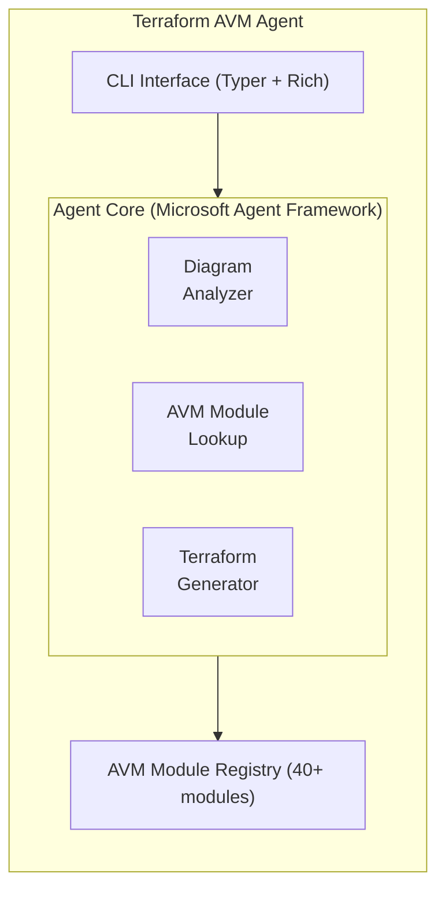

# Terraform AVM Agent

An AI agent built with the Microsoft Agent Framework that generates Terraform code using [Azure Verified Modules (AVM)](https://aka.ms/AVM).

## Features

- **Service-Based Generation**: Provide a list of Azure services and get a complete Terraform project
- **Architecture Diagram Analysis**: Upload an architecture diagram and the agent will identify services and generate code
- **Interactive Chat Mode**: Have a conversation with the agent to explore modules and generate code
- **AVM Module Registry**: Built-in knowledge of 40+ Azure Verified Modules
- **Production-Ready Output**: Generated code follows Terraform best practices

## Installation

```bash
# Clone the repository
git clone https://github.com/your-org/tf-avm-agent.git
cd tf-avm-agent

# Install dependencies
pip install -e .

# Or install with development dependencies
pip install -e ".[dev]"
```

### Prerequisites

- Python 3.10+
- An OpenAI API key or Azure OpenAI endpoint (for AI features)
- Terraform 1.9+ (for running generated code)

Set your API key:
```bash
export OPENAI_API_KEY="your-api-key"
# Or for Azure OpenAI
export AZURE_OPENAI_ENDPOINT="https://your-endpoint.openai.azure.com"
export AZURE_OPENAI_API_KEY="your-api-key"
```

## Quick Start

### Generate from Services List

```bash
# Generate Terraform for VM, storage, and key vault
tf-avm-agent generate -s "vm,storage,keyvault" -n "my-project" -o ./terraform

# Generate with specific location
tf-avm-agent generate -s "aks,acr,postgresql" -n "microservices" -l "westeurope" -o ./infra
```

### Interactive Chat Mode

```bash
tf-avm-agent chat
```

Example conversation:
```
You: Generate Terraform for a web application with a database

Agent: I'll help you create a Terraform project for a web application with a database...
[Generates code using AVM modules for App Service, SQL Database, etc.]
```

### List Available Modules

```bash
# List all modules
tf-avm-agent list-modules

# List by category
tf-avm-agent list-modules -c networking

# Get module info
tf-avm-agent info virtual_machine
```

### Search for Modules

```bash
tf-avm-agent search "kubernetes"
tf-avm-agent search "database"
```

## Python API

```python
from tf_avm_agent import TerraformAVMAgent, generate_terraform

# Quick generation
result = generate_terraform(
    services=["virtual_machine", "storage_account", "key_vault"],
    project_name="my-app",
    output_dir="./terraform"
)

# Using the agent class
agent = TerraformAVMAgent()

# Generate from services
result = agent.generate_from_services(
    services=["aks", "acr", "postgresql"],
    project_name="microservices",
    location="westeurope"
)

# Interactive with AI
response = agent.run("Create Terraform for a secure web app with monitoring")

# Analyze architecture diagram
response = agent.analyze_diagram(
    image_path="./architecture.png",
    project_name="cloud-app"
)
```

## Available Modules

The agent includes knowledge of 40+ Azure Verified Modules across categories:

| Category | Modules |
|----------|---------|
| **Compute** | Virtual Machine, VMSS, Container Apps, AKS, Functions, App Service |
| **Networking** | Virtual Network, NSG, Application Gateway, Load Balancer, Front Door, Firewall |
| **Storage** | Storage Account (Blob, Files, Queue, Table) |
| **Database** | SQL Server, PostgreSQL, MySQL, Cosmos DB, Redis |
| **Security** | Key Vault, Managed Identity |
| **Messaging** | Event Hub, Service Bus, Event Grid |
| **Monitoring** | Log Analytics, Application Insights |
| **AI** | Cognitive Services, Azure OpenAI, Machine Learning, AI Search |

## Generated Project Structure

```
my-project/
├── providers.tf      # Provider configuration
├── variables.tf      # Input variables
├── main.tf           # Resource definitions using AVM modules
├── outputs.tf        # Output values
├── terraform.tfvars.example  # Example variable values
├── .gitignore        # Git ignore file
└── README.md         # Project documentation
```

## Example Generated Code

```hcl
# main.tf
module "virtual-machine" {
  source  = "Azure/avm-res-compute-virtualmachine/azurerm"
  version = "0.18.0"

  name                       = "virtual-machine"
  resource_group_name        = azurerm_resource_group.main.name
  location                   = azurerm_resource_group.main.location
  virtualmachine_sku_size    = "Standard_D2s_v3"
  virtualmachine_os_type     = "Linux"
}

module "storage-account" {
  source  = "Azure/avm-res-storage-storageaccount/azurerm"
  version = "0.5.0"

  name                     = "storage-account"
  resource_group_name      = azurerm_resource_group.main.name
  location                 = azurerm_resource_group.main.location
  account_tier             = "Standard"
  account_replication_type = "LRS"
}
```

## Configuration

### Environment Variables

| Variable | Description |
|----------|-------------|
| `OPENAI_API_KEY` | OpenAI API key for AI features |
| `AZURE_OPENAI_ENDPOINT` | Azure OpenAI endpoint |
| `AZURE_OPENAI_API_KEY` | Azure OpenAI API key |
| `AZURE_OPENAI_DEPLOYMENT` | Azure OpenAI deployment name |

### CLI Options

```bash
tf-avm-agent --help
tf-avm-agent generate --help
tf-avm-agent chat --help
```

## Architecture



## Development

```bash
# Install development dependencies
pip install -e ".[dev]"

# Run tests
pytest

# Run linting
ruff check src/

# Type checking
mypy src/
```

## Contributing

Contributions are welcome! Please feel free to submit a Pull Request.

## License

MIT License - see LICENSE file for details.

## Resources

- [Azure Verified Modules](https://aka.ms/AVM)
- [Microsoft Agent Framework](https://github.com/microsoft/agent-framework)
- [Terraform Azure Provider](https://registry.terraform.io/providers/hashicorp/azurerm/latest)
